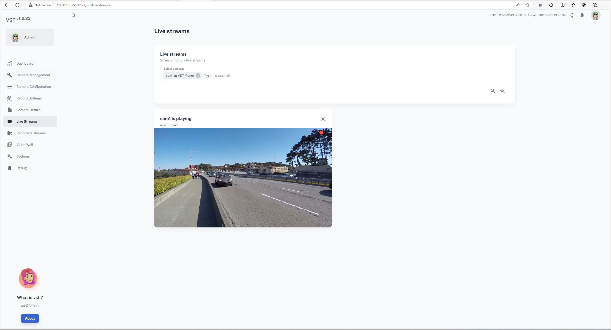

# Generative AI with Metropolis Microservices for Jetson


** This repository has been deprecated. Metropolis Microservices for Jetson has been renamed to [Jetson Platform Services](https://docs.nvidia.com/jetson/jps/). The NanoOWL example contained in this repository is now under the [Jetson Platform Services repository](https://github.com/NVIDIA-AI-IOT/jetson-platform-services). ** 


This project provides a reference for how to take an open source Generative AI model and integrate it with Metropolis Microservices for Jetson. 

Checkout the [Metropolis Microservices for Jetson Product Page](https://developer.nvidia.com/metropolis-microservices)


## Overview
Metropolis Microservices for Jetson is a suite of containerized services and applications that can be easily deployed using docker compose. To bring in a generative AI model there are two main steps - Building the Application and Deployment. 

For this example, we use the open source NanoOwl project as our generative AI model. This model allows for open vocabulary object detection, meaning the user can provide a prompt with a list of objects and NanoOwl will output bounding boxes around the detected objects from the user's prompt. The object list provided is not bounded to any specific classes, it is truly open vocabulary!

Once the reference example is launched the application will do the following:
- Use an RTSP camera stream as live input to the generative AI model
- Detect Objects in the live stream using NanoOwl (Open Vocabulary Object Detection)
- Generate an output RTSP live stream that shows the detected objects
- Output detection meta data to Redis in Metropolis Minimal Schema
- Accept prompt list updates through a REST Endpoint

With Metropolis Microservices, we can use the Video Storage Toolkit to manage and view live RTSP streams to serve as input to the model. The monitoring microservice can be used to view system information through Grafana while the application is running. The API Gateway (Ingress) microservice will expose the REST endpoint from the application for user's to update the prompts. Additonally, an analytic microservice can be added to ingest the metadata on the Redis Stream for down stream tasks (not shown in this example). 

* Note: This example supports only 1 camera stream as input the model 


## Project Structure
This project has two major components. The reference application code and the deployment configuration:

- The ```src``` folder contains the code and instructions needed to build a containerized application that can run the generative AI model and adds functionallity like RTSP stream I/O, Redis metadata output and a REST API for updating model configurations. To understand how to take a generative AI model and add extra functionality to enable integration with other microservices, go to the README in the ```src``` folder. 

- The ```deploy``` folder contains the docker compose configuration file that can launch the containerized generative AI application along with the Metropolis Microservices, in this case VST. By default, the docker compose configuration will pull a prebuilt docker container with the application code so you can immedietly deploy our reference example without building the container yourself. For more details on deployment go to the README in the ```deploy``` folder. 

To get started, follow the steps under quickstart to launch the reference example. To understand how the reference example works, go to the READMEs in the ```src``` and ```deploy``` folder for more information. 

## Quickstart 
To run the reference application, you will need to follow the jetson setup, build the generative AI container and then deploy the microservices. 

### Prerequisites: Jetson Setup

You must follow all the setup steps for the application to build and run properly. 

#### Metropolis Microservices
To setup your Jetson with the necessary software to run Metropolis Microservices, please go through the Quickstart Guide of the Metropolis on Jetson documentation found [here](https://docs.nvidia.com/moj/setup/quick-start.html) and follow the prepartion steps up to but not including "Install Application Bundle". This will explain how to setup an NGC account, install a BSP to your Jetson and install the platform services that the generative AI application will integrate with. 

#### Docker Setup

To build the docker conatiner, your docker settings must have the "default-runtime" set to "nvidia". 

To do this, modify the /etc/docker/daemon.json file on your system and add ```"default-runtime": "nvidia"```

```
{
    "runtimes": {
        "nvidia": {
            "path": "nvidia-container-runtime",
            "runtimeArgs": []
        }
    },

    "default-runtime": "nvidia"
}

```

Restart docker for the changes to take effect. 
```
sudo systemctl restart docker
```


Add your user to the docker group to allow docker command execution without sudo. Restart your terminal after running the following. 
```
sudo groupadd docker
sudo usermod -aG docker $USER
```


#### Misc
The generative AI container requires the jetson model to be written to /tmp/nv_jetson_model. Please run the following command before deployment. 
```
cat /proc/device-tree/model > /tmp/nv_jetson_model
```

* Note: If you have previously run the AI NVR example on your Jetson, then please follow [these steps](deploy/README.md#additional-steps-with-ai-nvr) BEFORE going through the quickstart. 


### Build Generative AI Container

To build the container, we make use of a prebuilt base image from the jetson-container's project. If you want to learn how to build this base container for yourself, please view the steps in the src/README.md [here](src/README.md)

### Step 1: Clone this repository 

```
git clone --recurse-submodules https://github.com/NVIDIA-AI-IOT/mmj_genai.git
```

### Step 2: Build the container with the Generative AI application

The jetson-containers project hosts a base container that we can use as a starting point. The base container holds important dependecies like the pytorch, transformers and jetson-utils libraries. We can take this base container and add our generative AI application code to it to produce a new container with our full application. By containerizing our application, 
To have seamless integration with the rest of metropolis microservcies. We need to also add our application code in the src directory of this repository to the docker container.

Change directory into the mmj_genai repository 
```
cd mmj_genai
```

The we can build the application container using the Dockerfile. This command will pull the prebuilt base conatiner, copy the application code into it and run a setup script to produce a new container with the application code and all dependencies. 

```
DOCKER_BUILDKIT=0 docker build . -t mmj:genai
```

This should only take a few minutes to run. Once completed, you will have a docker container named mmj:genai that can be deployed alongside Metropolis microservices. 


### Deploy The GenAI Application

With the container built, we can now deploy it with the other Metropolis microservices.

#### Update Ingress Configuration
From the root of the ```mmj_genai``` repository, change directory into the deploy folder. 
```
cd deploy
```

The API Gateway provided by MMJ, needs to be configured to allow web dashboards and the REST API to pass through and be available. To do this, we must add the config file for the GenAI application to ingress.  

```
sudo cp config/genai-nginx.conf /opt/nvidia/jetson/services/ingress/config/
```

* If you have previously added any ingress configurations, it is important to check that no routes are duplicated between any active ingress config files. This will cause the API Gateway to not run properly and dashboards and APIs may not be exposed properly. 

#### Launch Necessary Platform Services
This example requires the following services to be launched. Use systemctl to launch each of the servies. 

- Redis 
```
sudo systemctl start jetson-redis
```

- Ingress
```
sudo systemctl start jetson-ingress
```
If Ingress was already running from another MMJ application, then run a restart command instead 
```
sudo systemctl restart jetson-ingress
```

- Monitoring
```
sudo systemctl start jetson-monitoring
sudo systemctl start jetson-sys-monitoring
sudo systemctl start jetson-gpu-monitoring
```


#### Launch the Generative AI Application
With the platform services running and configured, we can now launch our generative AI application and the Video Storage Toolkit. 

In the deploy folder, the docker-compose.yaml holds the docker launch options to bring up both the generative AI application and VST. The containers can be launched by running the following command from the deploy folder. 
```
docker compose up -d
```

You can ensure the images have started successfully by running 
```
docker ps
```


If you want to stop the application at any time you can run the following command from the deploy folder.
```
docker compose down
```


### View the Running Services and Generative AI Output

Many of the services have dashboards that can be viewed through a web browser. To access these dashboards, you need the IP address of your Jetson. You can find this by running ```ifconfig``` from the cmd line and locating the inet address under your network adapater. 


#### Video Storage Toolkit (VST)

VST provides a web dashboard that can be accessed at http://jetson-ip:30080/vst. VST also has a REST API that can be used to interface with it. 

The generative AI application will query VST through the REST API to find an RTSP stream to use as input. For the generative AI application to find a stream we can manually add an RTSP stream through the web dashboard. 

Go to http://jetson-ip:30080/vst to view VST and add a camera stream. 

Once on the dashboard, go to the "camera management" tab, scroll down to ```add device manually``` and add a live RTSP stream. 


Once the live stream is added, the generative AI app will automatically find it throught VST REST API and use it as an input source. 




##### Creating a test RTSP Stream
If you do not have a live RTSP stream to add to VST, you can create on from an mp4 video on the Jetson. Place an mp4 file in your ~/Videos folder and in a separate terminal, run the following: 
```
docker run --volume ~/Videos:/videos --volume /tmp/nv_jetson_model:/tmp/nv_jetson_model --network=host -it --runtime nvidia dustynv/mmj:genai_deps-r36.2.0 bash
cd /videos
video-viewer --output-save=/tmp/null.mp4 --loop=-1 my_video.mp4 rtsp://0.0.0.0:8554/inputstream
```
The RTSP live stream should now be available at rtsp://jetson-ip:8554/inputstream .


#### RTSP Output

You can then open a media player like VLC to view the live output of the generative AI Application. By default this will be streamed to 
rtsp://jetson-ip:5011/out

*Note: If you are not able to connect and view the ouput stream, wait a few minutes and try again. The app may still be trying to connect and capture the input RTSP stream. If you are still not able to connect, try restarting the application by running ```docker compose down``` and then ```docker compose up -d``` again. 


#### REST API for Prompt Updates
Using REST GET requests, you can dynamically update the objects you want the model to detect. By default, the model is set to detect "a person". You can change this from the command line using curl, a scripting langauge or an application like Postman. 

```
curl "http://0.0.0.0:30080/genai/prompt?objects=a%20person,a%20hat&thresholds=0.1,0.2"
```
The endpoint expects two parameters, objects and thresholds. Each should be a comma separated list. 

- objects is a list of objects you want the model to detect. The model typically works better if you say "a object" instead of "object" for example using the prompt "a person" will work better than using the prompt "person". 

- thresholds is the sensitivty of detection for each object. If the threshold is too low, there will be many false positives. If the threshold is too high there will be many false negatives. The threshold should be tuned per object to suit your needs. A good starting value is 0.1. 

* Note: if you update the prompt via curl, then spaces in the prompt need to be replaced with %20

After sending a request to update the prompt, you should see the change after a few seconds on the output RTSP stream. 


#### Grafana

The Grafana dashboard can be viewed at http://jetson-ip:30080/grafana. If prompted for a login, the default username and password is "admin". The dashboard will show system statistics such as CPU and GPU monitoring.


#### Redis Output
The generative AI application will output the detection metadata (object bounding boxes and classes) in Metropolis Minimal Schema through a Redis Stream. This Redis Stream can be captured by an analytic application for downstream tasks such as object counting, tracking and heatmapping. To view the redis output from the command line you can run the redis_viewer.py in the ```moj_genai/src``` folder. 

In a new terminal
```
python3 -m pip install redis
cd ~/moj_genai/src
python3 redis_viewer.py
```


## Next Steps

To further understand how to take a geneartive AI model and build an application that is compatible with Metropolis Microservcies, look at the [README](src/README.md) in the ```src``` folder. 

To learn how to use docker compose to deploy the containerized application with VST, look at the [README](deploy/README.md) in the ```deploy``` folder. 


## Troubleshooting

### #1
If you run 'docker compose up -d' to deploy the application and see this error 

```
Error response from daemon: failed to create task for container: failed to create shim task: OCI runtime create failed: runc create failed: unable to start container process: error during container init: error mounting "/tmp/nv_jetson_model" to rootfs at "/tmp/nv_jetson_model": mount /tmp/nv_jetson_model:/tmp/nv_jetson_model (via /proc/self/fd/6), flags: 0x5000: not a directory: unknown: Are you trying to mount a directory onto a file (or vice-versa)? Check if the specified host path exists and is the expected type
```

The container was unable to mount the /tmp/nv_jetson_model file and likely created a directory instead. Delete the directory and use cat to output your jetson model to the /tmp/nv_jetson_model folder with these two commands:

```
sudo rmdir /tmp/nv_jetson_model
cat /proc/device-tree/model > /tmp/nv_jetson_model
```

Then try to deploy again. 

### #2
If you are unable to access VST http://jetson-ip:30080/vst after deployment, you can also try accessing it at 

```http://jetson-ip:81```  

This bypasses the API Gateway so is not recommended, but will allow you to confirm if VST is running. 

If VST is accesible on port 81 but not port 30080, then there is an issue with the API gateway. You can try to restart the API Gateway by running:

```
sudo systemctl restart jetson-ingress
```

If you are still unable to access VST through the API Gateway (port 30080) then there may be an issue with your Ingress configuration file. Ingress configuration is located at /opt/nvidia/jetson/services/ingress/config. Check the deployment [readme](deploy/README.md) and the API gateway [documentation](https://docs.nvidia.com/moj/platform-services/ingress.html) for more information. 
