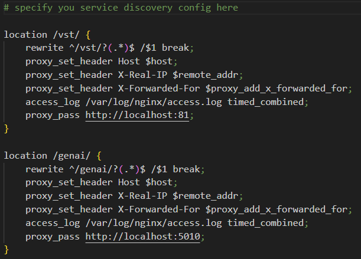

# Deploy Generative AI App and Metropolis Microservices for Jetson

This folder contains the docker compose and necessary configuration to launch the GenAI container and Video Storage Toolkit through docker compose. 

## Deploy The Generative AI Application

These are the steps to launch the application with the prebuilt docker container. Follow the quickstart guide for more explanation on these steps. 

### Start the required platform services
```
sudo systemctl start jetson-redis
sudo systemctl start jetson-ingress
sudo systemctl start jetson-monitoring
sudo systemctl start jetson-sys-monitoring
sudo systemctl start jetson-gpu-monitoring
```

For more information on jetson platform services checkout this (page)[https://docs.nvidia.com/moj/Platform_Services_Toc.html]). 

### Ingress Configuration
Ingress is a platform service that exposes specific endpoints running on the Jetson to the outside world. If you have a service you need to expose, then you must configure the config/genai-nginx.conf file to allow your endpoints to pass through. 

#### How To Modify Ingress Configuration
For our generative AI example, we have three ports that need to be exposed. 

1) Video Storage Toolkit (Port 81)
2) GenAI REST Endpoint (Port 5010)
3) Grafana (Port 3000)

To do this we can create the following config which is the config/genai-nginx.conf file.




This configuration will map
- http://localhost:81       -> http://jetson-ip:30080/vst
- http://localhost:5010     -> http://jetson-ip:30080/genai
- http://localhost:3000     -> http://jetson-ip:30080/grafana

For each port we want to expose, we need to define a location that our service will be routed to. To expose VST, we start by defining the location /vst/ that we will use to access VST from the outside. After than you can change the proxy_pass ___ line to your internally running service, in our case VST runs internally at http://localhost:81.

```
location /vst/ {
    rewrite ^/vst/?(.*)$ /$1 break;
    proxy_set_header Host $host;
    proxy_set_header X-Real-IP $remote_addr;
    proxy_set_header X-Forwarded-For $proxy_add_x_forwarded_for;
    access_log /var/log/nginx/access.log timed_combined;
    proxy_pass http://localhost:81;
}
```
This will route http://localhost:81 to http://jetson-ip:30080/vst. 

By default ingress will route all services configured this way to port 30080. 

#### How To Update Ingress Configuration
If you modify the config/genai-nginx.conf you must copy it to the ingress config folder and restart the service. 

```
sudo cp config/genai-nginx.conf /opt/nvidia/jetson/services/ingress/config/
sudo systemctl restart jetson-ingress
```

### Launch the Application
In the deploy folder, the docker-compose.yaml holds the launch options to bring up both the GenAI application and VST. Both services will be launched by running the following command from the deploy folder. 
```
docker compose up -d
```

### Stop the Application
If you want to stop the application at any time you can run the following command from the deploy folder.
```
docker compose down
```


## Additional Steps with AI NVR
The AI NVR example launches many of the same platform services and applications such as Ingress and VST. If AI NVR is running while trying to deploy this genAI application then there will be errors. 

Here are the the steps to ensure the genAI application will run if AI NVR has been launched on your Jetson. 

1) Shut down the AI NVR example 

From the ai_nvr repository folder on your system run: 

```
docker compose down
```

2) Delete the AI NVR Ingress Configuration

The AI NVR Ingress configuration will conflict the the GenAI ingress configuration. So it is necessary to delete the ai-nvr-nginx.conf file by running: 

```
sudo rm /opt/nvidia/jetson/services/ingress/config/ai-nvr-nginx.conf
sudo systemctl stop jetson-ingress
```

Now you can continue with the [quickstart](../README.md#quickstart). 