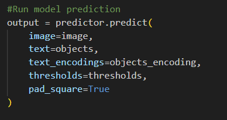
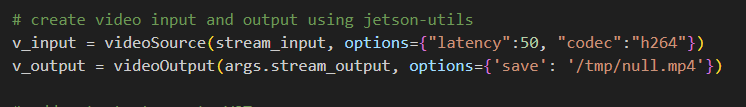
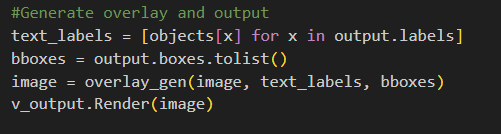
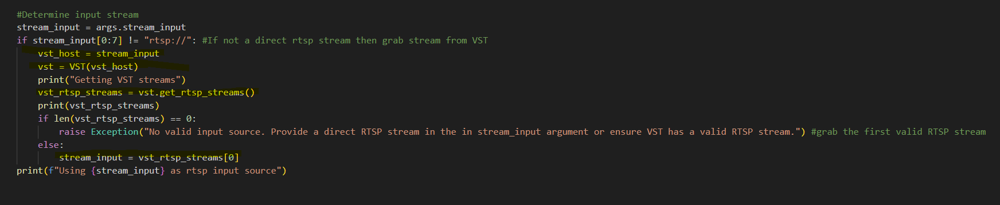
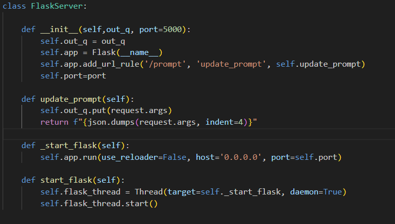
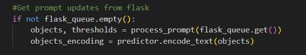
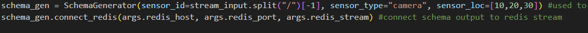

# Building a generative AI Application with Metropolis Microservices for Jetson
The main.py application is a reference python script that shows to take a geneative AI model and use the mmj_utils, jetson_utils and other public python packages to make a containerized application that easily integrated with Metropolis Microservices for Jetson. 


This Readme shows three things 

1) main.py usage
2) How to make a generative AI model compatible with Metropolis Microservices
3) How to build the docker container for deployment


## Main.py Usage

```
usage: main.py [-h] [stream_input] [--stream_output STREAM_OUTPUT] [--redis_host REDIS_HOST] [--redis_port REDIS_PORT] [--redis_stream REDIS_STREAM] [--objects OBJECTS] [--thresholds THRESHOLDS] [--flask_port FLASK_PORT] [--model MODEL] [--image_encoder_engine IMAGE_ENCODER_ENGINE]
        
positional arguments:  
  stream_input          URI of an RTSP stream (rtsp://0.0.0.0:8554/stream) OR VST address (http://0.0.0.0:81)  

options:  
  -h, --help            show this help message and exit  
  --stream_output STREAM_OUTPUT  
                        URI of the output stream  
  --redis_host REDIS_HOST  
                        Host name of the redis server  
  --redis_port REDIS_PORT  
                        Port number of the redist server  
  --redis_stream REDIS_STREAM  
                        Name of redis stream to send output metadata  
  --objects OBJECTS       
                        example: a person, a box, a cone  
  --thresholds THRESHOLDS  
                        example: 0.1,0.2,0.15  
  --flask_port FLASK_PORT  
                        Port for flask  
  --model MODEL           
                        Name of model to use  
  --image_encoder_engine IMAGE_ENCODER_ENGINE  
                        Path to trt encoder engine  
```

The major components that can be configured in main.py are Flask, NanoOwl, Redis and the RTSP streams. 

### Flask
The prompts can be updated by sending a GET request to the flask server. The endpoint expects two parameters: 'objects' and 'thresholds' the value of both parameters should be a comma separated list of objects and thresholds. A threshold should be provided for each object and controls the sensitivty of the detection. 

This can be done from the command line with CURL 
```
curl "http://0.0.0.0:5000/prompt?objects=a%20person,a%20hat&thresholds=0.1,0.2"
```
### NanoOwl
NanoOwl will attempt to detect objects listed in the given prompt. It is open vocabulary so there is no limit on the type of objects that can be detected. 

The inital prompt can be configured when launching main.py with the follwing arguments:
--objects
--thresholds

Each argument expects a comma separated list. The number of thresholds and objects provided must be the same. 

Example:
python3 main.py rtsp://0.0.0.0:8554/stream --objects "a person, a hat, a bike" --thresholds "0.1, 0.2, 0.09"

### Redis
By default will try to connect to a locally hosted redis server on port 6379 and output metadata on a stream named "owl".  
If you don't have redis then you can install it either inside or outside the docker container. 
```
sudo apt-get install redis
```


The redis server can be configured with the following arguments:
--redis_host
--redis_port
--redis_stream

Example:
```
python3 main.py rtsp://0.0.0.0:8554/stream --redis_host 0.0.0.0 --redis_port 8978 --redis_stream mystream
```

The output is serialized json that describes metadata about the camera and objects detected in each frame. The output follow the Metropolis Minimal Schema to allow compatible with analytic services. 

You can view the redis output by running the redis_viewer.py script in a separate terminal while main.py is running. 
```
python3 redis_viewer.py --redis_host 0.0.0.0 --redis_port 8978 --redis_stream mystream
```

### RTSP

#### Input Stream
The input stream can be an RTSP stream URL or a Video Storage Toolkit (VST) URL

Examples:

VST
```
python3 main.py http://0.0.0.0:81
```

RTSP
```
python3 main.py rtsp://0.0.0.0:8554/stream
```

If a VST url is provided, the script will find the first valid RTSP stream hosted by VST to use as input. 

#### Output Stream
The output RTSP stream will mirror the input stream but will have bounding boxes and text labels for objects detected by NanoOwl. 

The output stream URL can be configured with the following argument:
--stream_output

Example:
```
python3 main.py rtsp://0.0.0.0:8554/stream --stream_output rtsp://0.0.0.0:6000/mystream
```


## How to make a Generative AI model compatible with Metropolis Microservices

The purpose of this reference example is to show how to take a genertaive AI model and prepare it for integration with Metropolis Services. 

main.py is the top level python script that can be used as a recipe to bring in your own GenAI models. 

Most open source models provide an interface for loading the model and inferencing on a single image. We can take (NanoOwl)[https://github.com/NVIDIA-AI-IOT/nanoowl] for example.



This generative AI model provides a simple example of how to inference on a single image but to take advantage of Metropolis Services, we need more capability that just inferecing on a single image. 

We need to add 
1) RTSP stream I/O
2) Detection Overlay Generation
3) VST Integration to manage the input stream
4) REST Endpoint to update the prompts
5) Redis Output in Metropolis Minimal Schema

To add these features, we can use some the python packages, mmj_utils, jetson_utils, redis and flask. 

### Useful Python Packages

#### jetson_utils
The ```jetson_utils``` library provides CUDA accelerated multimedia utilities for Jetson in C++ and Python. We will use jetson_utils create our RTSP stream input and output. For more information visit the (jetson_utils GitHub Page)[https://github.com/dusty-nv/jetson-utils].

The main components we will use in this example from jetson_utils are the videoSource and videoOutput classes. These classes allow for video streaming in and out from video files, RTSP streams and WebRTC. 

#### mmj_utils
The ```mmj_utils``` library provides easy to use classes to generate detection overlays, metadata generation in Metropolis Minimal Schema and VST integration. For full details on the mmj_utils library visit the (mmj_utils GitHub Page)[https://github.com/NVIDIA-AI-IOT/mmj_utils]

From mmj_utils we will use the SchemaGenerator, DetectionOverlayCUDA and VST classes. The SchemaGenerator will help produce metadata in Metropolis Minimal Schema and output this metadata on a Redis stream. DetectionOverelayCUDA is a cuda accelerated overlay generator that can draw object bounding boxes and text labels. It is highly configurable to change the size, position and colors of the labels and bounding boxes. The VST class is a python wrapper for the VST REST API. It provides several convenient functions such as retreiving a list of cameras and streams from VST. 

#### Redis & Flask
To interface with Redis through Python, we will use the ```redis``` package. This provides functionality to interact with all the features Redis provides such as streams. We will also use the ```flask``` python package to create a REST endpoint that can be used to update our GenAI prompts.


### How to add RTSP Stream I/O

The jetson-utils package provides two classes enable RTSP I/O: videoSource, videoOutput



After instantiating a videoSource and videoOutput object, you can use  ```v_input.capture()``` and ```v_output.render(image)``` to receive and output frames from RTSP streams. 

Now we can just wrap the model inference code with RTSP input and output to go from inferencing on a single image to inferencing on a live RTSP stream. 

### How to add a Detection Overlay
We want to show bounding boxes the model produces on the output stream. To do this, we need to manipulate the input image and draw boxes and text. 

The mmj_utils package provides a DetectionOverlayCUDA object that can easily be used for this. This object can be called to draw bounding boxes and text on an image using CUDA accelerated functions.



The DetectionOverlayCUDA object is called by passing the image, list of labels and list of bounding boxes from the model and will return a modified image with the detection overlay. This modified image can then be rendered to the output RTSP stream. 

### How to add VST Integration
The Video Storage Toolkit provides a nice dashboard and REST API to manage camera streams. Using the VST object from mmj_utils, you can easily interface with the VST through Python. 

In this example, we use the VST object to get an RTSP stream to use as an input for our GenAI model.



We can create a VST object by providing the host URL. Then use the ```get_rtsp_streams``` function to get a list of available streams to use as input. 

### How to add a REST Endpoint
Many GenAI models accept natural language prompts as input or can be dynamically configured to change their behavior. To enable these types of configurations, we show how to use [Flask](https://flask.palletsprojects.com/en/3.0.x/) to create a REST endpoint that can be used to send updates to the GenAI application. 

For NanoOwl, we want to add the ability to update the prompts from a GET request. To do this, we create a wrapper for flask in flask_server.py to allow easy integration with main.py. 



Now in main.py, we can simply create a FlaskServer object and launch the server. 

When the flask server receives a GET Request, it will place a dictionary with the request parameters in a Queue. 

This Queue is then checked in our main loop to determine if the prompt needs to be updated. 



### How to add Redis Metadata Output
For the detected objects, the model will output the label and bounding box. We use this information to generate the overlay but what if we want to use this information for other downstream tasks like object tracking, counting or heatmapping? We can do this by writing out the meta data on a Redis Stream in Metropolis Minimal Schema. Then an analytic microservice could capture this information for further insights.

To output on a Redis stream in Metropolis Minimal Schema we can use the SchemaGenerator object from mmj_utils. All we have to do is instantiate with the camera settings, connect to a Redis server, and then call the object with a list of labels and bounding boxes. For this example we have dummy values for the camera settings but these could come from VST using the python API. 




Checkout ```main.py``` to see the full code. With all the building blocks from mmj_utils and jetson_utils, it only takes about 100 lines of code to turn a model inference example into a full application capable of integrating with Metropolis Services. 

## Generative AI Container

The quickstart shows to build the generative AI container from a prebuilt base container with all the dependencies. If you would like to build the base container yourself, you can do so with the jetson-containers project. 

#### Step 1: Setup the jetson-containers repository 

The jetson-containers project is an easy way to build a custom docker container with jetson compatible dependencies like PyTorch, Tensorflow etc. 

clone and setup the [jetson-containers repository](https://github.com/dusty-nv/jetson-containers)

```
sudo apt-get update && sudo apt-get install git python3-pip
git clone --depth=1 https://github.com/dusty-nv/jetson-containers
cd jetson-containers
pip3 install -r requirements.txt
```

Follow the jetson-containers setup guide prior to building the containers https://github.com/dusty-nv/jetson-containers/blob/master/docs/setup.md

It is important that the docker default runtime is set to NVIDIA as shown in the system setup guide. 

Once jetson-containers is setup you can start building a container

### Step 2: Build the container with the geneative AI dependencies

The jetson-containers project provides a list of modular packages available here https://github.com/dusty-nv/jetson-containers/tree/master/packages that can be combined to build a custom container. 

For this example we will use the following packages:

```pytorch torch2trt transformers opencv jetson-utils```

To build a container with these packages, use the build.sh script in the root of the jetson-containers repository: 

```
cd jetson-containers
./build.sh --name mmj:genai_deps-r36.2.0 pytorch torch2trt transformers opencv jetson-utils
```

This will build a container named mmj:genai_deps-r36.2.0 which will contain all the listed packages needed to run the generative AI application. The Xs will be dependent on your jetpack version.
* Building the container will take some time. Potentially an hour or two.

Once the container is done being built, you can run 
```
docker images 
```
to get a list of the images that were built and find the tag associated with the mmj container. If you are on the Jetpack 6 developer preview then the name will be 

mmj:genai_deps-r36.2.0

We now have a conatiner named mmj:genai_deps-r36.2.0 that contains most of the necessary dependencies to run the generative AI reference application Jetson. You can easily use jetson-containers and customize the package list to include the dependecies needed for your own models. 


If you want to run the container manually without the other MMJ services, you can follow these steps. 

Enter the mmj_genai docker container shell 
```
docker run -it --network=host --runtime nvidia mmj_genai:latest bash
```
The current directory will automatically be the src directory in the mmj_genai repository. 

Run main.py to launch the demo. 

A minimal example: 
```
python3 main.py rtsp://0.0.0.0:8554/inputstream
```

You can replace the rtsp URL to any available RTSP stream.

Once launched, you can view the output at rtsp://0.0.0.0:6000/out using a media player like VLC. 
You can control the prompt through GET requests. To do so from the command line you can use curl 

```
curl "http://0.0.0.0:5000/prompt?objects=a%20person,a%20hat&thresholds=0.1,0.2"
```


* If you do not have a live RTSP stream you can create on from an mp4 video on the Jetson. Place an mp4 file in your ~/Videos folder and in a separate terminal, run the following: 
```
docker run --volume ~/Videos:/videos --volume /tmp/nv_jetson_model:/tmp/nv_jetson_model --network=host -it --runtime nvidia mmj_genai:latest bash
cd /videos
video-viewer --output-save=/tmp/null.mp4 --loop=-1 my_video.mp4 rtsp://0.0.0.0:8554/inputstream
```
The RTSP live stream now be available at rtsp://0.0.0.0:8554/inputstream to use as input to the main.py script. 

Once launched, main.py will do several things related to Flask, NanoOwl, Redis and RTSP
1) Launch a flask server on port 5000 that can be used to update the open vocabulary prompts via a REST endpoint. 
2) Load the NanoOwl model and inference on the input stream
3) Connect to a locally hosted redis server and output metadata to a stream name "owl".
4) Launch an RTSP server that will show the object detection overlay hosted at rtsp://0.0.0.0:6000/out

To run the generative AI docker container with the rest of the Metropolis Microservices, checkout the Readme in the ```deploy``` folder. 